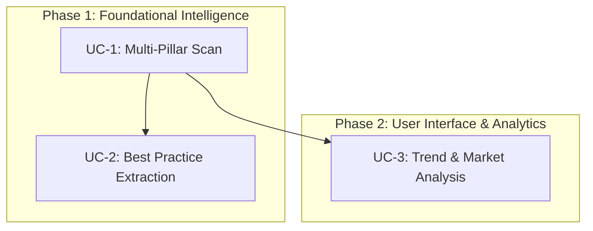

# Core Use Cases: AI-Age Growth Intelligence Platform

## Initiative Summary
The **AI-Age Growth Intelligence Platform** (`growth-intel-agent`) is an agentic workspace designed for **Strategy Consultants & Growth Equity Analysts** who need to automate the research, scoring, and analysis of target companies across the **Eight Pillars of Growth in the Age of AI** to identify investment opportunities or consulting recommendations.

---

## Core Use Cases Table

| # | Use Case | Audience | Trigger | End-to-End Experience | Value Delivered | Testable Acceptance Criteria | Development Phase |
|---|---|---|---|---|---|---|---|
| **UC-1** | **Automated Multi-Pillar Company Scan** | Strategy Consultant | Entering a company name on the dashboard and clicking "Evaluate Brand". | The system runs a background telemetry scan, invokes the ReAct agent to conduct web research, evaluates the brand against the Eight Pillars using `scoring_guide.md`, and saves a structured report in SQLite. | Speeds up company research from hours to minutes; establishes a quantitative growth baseline. | 1. `gather_telemetry` triggers and retrieves crawler status & tech stack. 2. ReAct agent streams thoughts and outputs a valid `CompanyEvaluation` JSON schema. 3. Report is stored in SQLite and displayed on the dashboard. | Phase 1: Foundational Intelligence |
| **UC-2** | **Dynamic Best Practice Extraction** | Strategy Consultant | ReAct agent identifies a state-of-the-art growth capability (score > 8.0) during evaluation. | The agent extracts the benchmark and saves it as a new Markdown file in the `standards/` directory. On subsequent evaluations, this file is dynamically loaded into context. | Automatically expands the benchmark database with real-world examples, improving scoring quality. | 1. Agent returns non-empty `discovered_best_practices` list. 2. System creates a `best_practice_[company]_pillar_[number].md` file. 3. Log verification showing standards loaded from that file on next run. | Phase 1: Foundational Intelligence |
| **UC-3** | **Historical Trend & Competitive Analysis** | Strategy Consultant | Selecting a company from the sidebar or viewing the comparison tab. | The UI requests trend and comparison APIs, plotting historical scores and individual pillar trajectories on charts, contrasting the company against the market average. | Helps users visualize a company's trajectory and relative positioning in the market for client presentations. | 1. Sidebar selection fetches `/api/companies/{company_name}/trends`. 2. Trend API returns a time-series list of scores. 3. Comparison API returns averages across all evaluated companies. | Phase 2: User Interface & Analytics |

---

## Detailed Use Case Breakdown

### UC-1: Automated Multi-Pillar Company Scan
* **Audience**: Strategy Consultant
* **Trigger**: Inputting a company name (e.g., "Back Market") and clicking "Evaluate Brand" on the UI.
* **Step-by-Step Experience**:
  1. User enters the company name.
  2. The system initiates an automated API telemetry scan via `app/telemetry.py` to check AI crawler permissions in `robots.txt`, marketing tech stack tools, and app ratings.
  3. The ReAct agent is initialized with these telemetry inputs, along with existing benchmark standards from the `standards/` directory.
  4. The agent executes web search queries (via Serper or DuckDuckGo) and fetches relevant articles or developer docs.
  5. The agent scores each of the 8 pillars, compiles the biggest opportunities, challenges, and discovered best practices, and returns structured data validating the `CompanyEvaluation` schema.
  6. The backend saves the evaluation to SQLite and streams logs and results back to the dashboard in real-time.
* **Value Delivered**: Saves hours of manual research; provides a consistent, objective baseline score for growth capability comparison.
* **Acceptance Criteria**:
  - Telemetry completes successfully.
  - Final output matches the `CompanyEvaluation` JSON schema structure.
  - SQLite database record is successfully inserted and populated.

### UC-2: Dynamic Best Practice Extraction
* **Audience**: Strategy Consultant / System Administrator
* **Trigger**: The ReAct agent encounters an outstanding capability (scoring > 8.0) under a growth pillar during its analysis.
* **Step-by-Step Experience**:
  1. The ReAct agent identifies the capability and populates the `discovered_best_practices` field in the final `CompanyEvaluation` output.
  2. The backend intercepts the list and writes each practice as a separate Markdown file in `standards/` matching the format `best_practice_[company_slug]_pillar_[pillar_number].md`.
  3. On subsequent evaluations, `get_standards_context()` scans the `standards/` folder and appends the new file's content to the standard reference prompt, enabling the model to compare other companies against this newly discovered standard.
* **Value Delivered**: Continuous learning system that automatically builds a rich database of industry benchmarks.
* **Acceptance Criteria**:
  - A Markdown file is generated in `standards/` with correct headers and date.
  - The content is loaded and injected into subsequent prompts.

### UC-3: Historical Trend & Competitive Analysis
* **Audience**: Strategy Consultant
* **Trigger**: Consultant clicks on a saved company name in the sidebar or toggles the comparison view.
* **Step-by-Step Experience**:
  1. User selects a saved company.
  2. The frontend requests the trends endpoint (`/api/companies/{company_name}/trends`) and comparison endpoint (`/api/market/comparison`).
  3. The dashboard renders line charts showing how the overall score and individual pillar scores have changed across multiple evaluations.
  4. A comparison radar chart contrasts the company's latest score against the industry average.
* **Value Delivered**: Provides historical context and clear visual comparison of performance relative to the market.
* **Acceptance Criteria**:
  - Selecting a company displays the historical trend chart.
  - API successfully handles multiple evaluations of the same company and maps them chronologically.

---

## Suggested Epic Mapping & Phase Sequence

### Phase 1: Foundational Intelligence
- **Focus**: Core data collection and ReAct agent scoring.
- **Epics**:
  1. Setup SQLite database schemas for company evaluations and best practices.
  2. Integrate automated telemetry extraction (robots.txt, BuiltWith stack).
  3. Create the ReAct scoring agent with standard guidelines (`scoring_guide.md`).
  4. Implement automated file generation for newly discovered best practices.

### Phase 2: User Interface & Visual Analytics
- **Focus**: Displaying findings and tracking historical changes.
- **Epics**:
  1. Build the dashboard UI with sidebar, company hero panel, and evaluation streaming.
  2. Build historical trends tracking and radar-chart comparisons.
  3. Add logs terminal to display agent thoughts transparently.
